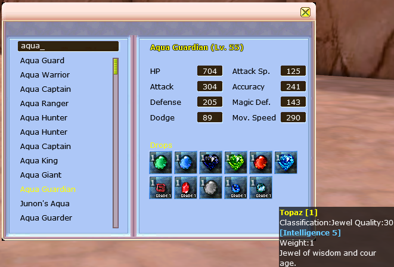
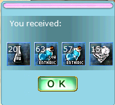
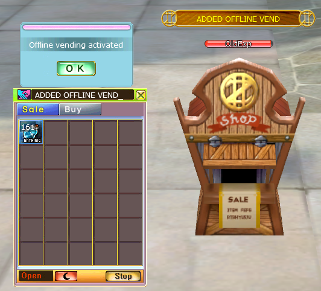
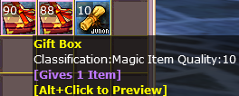
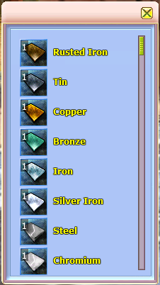
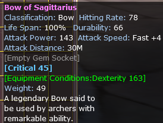
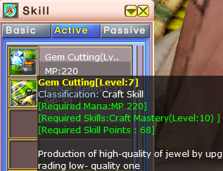

# LunaROSE

LunaROSE is a custom iROSE-based project featuring new gameplay systems, server-controlled content, and various client improvements.

## Features and Improvements

### 1. Monster Database

**Added:** An in-game Monster Database.

The Monster Database allows players to view detailed information about monsters directly inside the game client.

---

### 2. Custom Bag and Box System

**Added:** A custom bag and box reward system controlled entirely by the server.

The contents and rewards of bags and boxes can be configured server-side without requiring additional client-side changes.

---

### 3. Upgrade Window Progress Bar Fix

**Fixed:** The upgrade window now displays progress bar updates correctly during the upgrade process.

---

### 4. Offline Vending

**Added:** An offline vending system.

Players can keep their personal shop active after disconnecting from the game, allowing other players to continue purchasing their items while they are offline.

---

### 5. Custom Bought and Sold Messages

**Added:** Custom notifications for purchased and sold items.

Players now receive clearer messages when they purchase an item or when an item is sold through their personal shop.

---

### 6. Custom Bag and Box Tooltips

**Added:** Custom tooltips for bags and boxes.

The tooltip displays the number of possible reward items and includes a hint explaining how to open the bag preview interface.

---

### 7. Bag Preview Interface

**Added:** A new preview interface for bags and boxes.

Players can preview the possible rewards inside a bag or box before opening it.

---

### 8. Improved Item Tooltips

**Improved:** Item tooltip appearance and readability.

Tooltip labels are now easier to distinguish, and empty gem sockets display a dedicated description.

---

### 9. Improved Skill Window and Tooltips

**Improved:** Skill window usability and tooltip readability.

Skill tooltips now have a clearer appearance, and the skill window hides the plus button when a skill has reached its maximum level.

